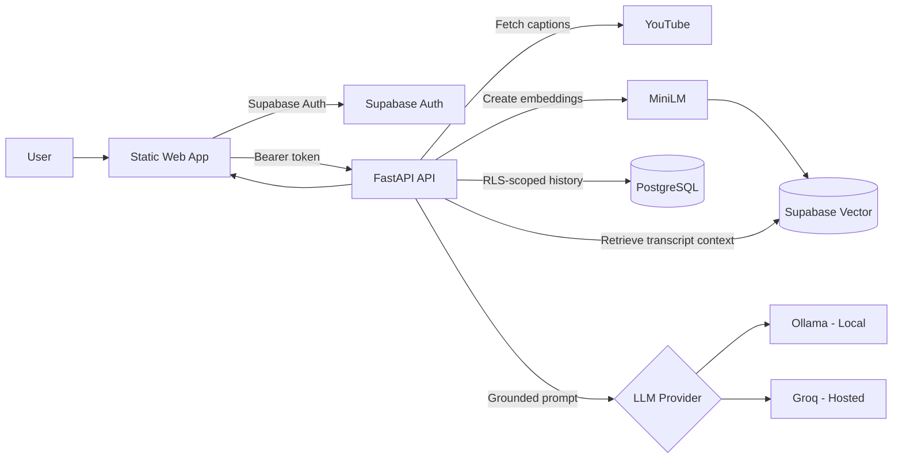

<div align="center">

# Framewise

### Turn YouTube videos into searchable, source-grounded conversations.

Framewise is a full-stack Retrieval-Augmented Generation application that converts
YouTube transcripts into private knowledge bases and answers questions with
timestamped evidence from the original video.

[](https://www.python.org/)
[](https://fastapi.tiangolo.com/)
[](https://supabase.com/)
[](https://www.langchain.com/)
[](#testing)

[Features](#features) • [Architecture](#architecture) • [Setup](#local-setup) • [API](#api-reference) • [Deployment](#deployment)

</div>

---

## Overview

Framewise lets users add a YouTube video, process its transcript, and ask questions
about what was actually said. Each answer is grounded in retrieved transcript
excerpts and includes timestamped YouTube links for quick verification.

Unlike a general-purpose chatbot, Framewise is deliberately constrained to the
selected video's transcript. If the transcript does not contain the answer, the
assistant says so instead of relying on outside knowledge.

## Features

| Capability | Description |
| --- | --- |
| Transcript ingestion | Extracts available YouTube captions, preserves timestamps, and creates overlapping chunks. |
| Semantic retrieval | Generates 384-dimensional MiniLM embeddings and stores them with Supabase Vector. |
| Grounded answers | Sends only relevant transcript excerpts and recent conversation history to the selected LLM. |
| Timestamp citations | Links every retrieved source back to the relevant moment on YouTube. |
| Private user libraries | Gives every authenticated user an isolated video library and chat history. |
| Secure access control | Enforces ownership with Supabase Auth, PostgreSQL Row-Level Security, grants, and scoped RPC functions. |
| Shared ingestion | Deduplicates transcript processing when multiple users add the same YouTube video. |
| Safe deletion | Deletes only the requesting user's library entry and conversation while retaining shared transcript data when needed. |
| Automatic retention | Removes inactive user-video relationships after seven days through a daily Supabase Cron job. |
| Flexible inference | Uses Ollama locally and Groq's OpenAI-compatible API in hosted environments. |
| Responsive interface | Provides a dependency-free HTML, CSS, and JavaScript workspace for authentication, ingestion, and chat. |

## Architecture



### Request flow

1. Supabase authenticates the user and issues an access token.
2. FastAPI verifies the token before allowing video or chat operations.
3. Transcript segments are chunked, embedded, and stored with their video metadata.
4. A question is embedded and matched only against documents for the selected video.
5. Retrieved excerpts and recent user-specific history are sent to the configured LLM.
6. The response is returned with timestamped transcript sources.

## Tech stack

| Layer | Technologies |
| --- | --- |
| Frontend | HTML5, CSS3, JavaScript, Supabase JS |
| Backend | Python 3.12, FastAPI, Uvicorn, Pydantic |
| RAG | LangChain, Sentence Transformers, `all-MiniLM-L6-v2` |
| Local LLM | Ollama with `llama3.2:3b` |
| Hosted LLM | Groq through an OpenAI-compatible endpoint |
| Database | Supabase PostgreSQL, Vector extension, PostgreSQL Cron |
| Authentication | Supabase Auth and JWT verification |
| Testing | Pytest, HTTPX, FastAPI ASGI transport |
| Deployment targets | Vercel for the frontend and Render-compatible hosting for the API |

## Project structure

```text
youtube-transcript-rag/
├── backend/
│   ├── app/
│   │   ├── auth/          # Access-token verification
│   │   ├── routers/       # Video and chat endpoints
│   │   ├── schemas/       # Request and response models
│   │   └── services/      # Ingestion, retrieval, LLM, and persistence
│   ├── tests/             # Backend test suite
│   ├── .env.example       # Safe environment template
│   └── requirements.txt
├── frontend/
│   ├── index.html         # Authentication page
│   ├── chat.html          # Transcript workspace
│   ├── app.js             # Auth and application behavior
│   ├── style.css          # Responsive UI
│   └── config.js          # Public browser configuration
├── supabase/
│   └── schema.sql         # Tables, RLS, functions, indexes, and Cron
└── requirements.txt       # Root dependency entry point
```

## Local setup

### Prerequisites

- Python 3.12+
- A Supabase project
- Ollama for local inference

### 1. Clone the repository

```bash
git clone https://github.com/ekagrazi/youtube-transcript-rag.git
cd youtube-transcript-rag
```

### 2. Create a virtual environment

```bash
python -m venv .venv
```

PowerShell:

```powershell
.\.venv\Scripts\Activate.ps1
```

### 3. Install dependencies

```bash
python -m pip install --upgrade pip
pip install -r requirements.txt
```

For test dependencies:

```bash
pip install -r backend/requirements-dev.txt
```

### 4. Configure Supabase

1. Open the SQL editor in your Supabase project.
2. Run [`supabase/schema.sql`](supabase/schema.sql).
3. Copy the backend environment template:

```powershell
Copy-Item backend/.env.example backend/.env
```

4. Fill in the Supabase URL, publishable key, and backend secret key.

The real `backend/.env` is ignored by Git and must never be committed.

### 5. Configure the browser

Update [`frontend/config.js`](frontend/config.js) with:

- Your Supabase project URL
- Your Supabase publishable key
- Your local backend URL, normally `http://localhost:8000`

Only public browser configuration belongs in this file. Never place a Supabase
secret key or Groq API key in the frontend.

### 6. Start Ollama

```bash
ollama pull llama3.2:3b
ollama serve
```

Keep `LLM_PROVIDER=ollama` in `backend/.env` for local development.

### 7. Start the API

From the repository root:

```bash
cd backend
uvicorn app.main:app --reload --host 127.0.0.1 --port 8000
```

The API documentation is available at `http://localhost:8000/docs`, and the
health endpoint is available at `http://localhost:8000/health`.

### 8. Start the frontend

In a second terminal, from the repository root:

```bash
python -m http.server 3000 --directory frontend
```

Open `http://localhost:3000`.

## Environment variables

| Variable | Required | Purpose |
| --- | --- | --- |
| `SUPABASE_URL` | Yes | Supabase project API URL |
| `SUPABASE_PUBLISHABLE_KEY` | Yes | Public key used for authentication and user-scoped requests |
| `SUPABASE_SECRET_KEY` | Yes | Backend-only key used for privileged ingestion operations |
| `CORS_ORIGINS` | Yes | Comma-separated frontend origins allowed by the API |
| `LLM_PROVIDER` | Yes | `ollama` for local development or `hosted` for production |
| `OLLAMA_BASE_URL` | Local | Ollama server address |
| `OLLAMA_MODEL` | Local | Local model identifier |
| `HOSTED_API_BASE_URL` | Hosted | OpenAI-compatible hosted inference endpoint |
| `HOSTED_API_KEY` | Hosted | Backend-only hosted provider key |
| `HOSTED_MODEL_NAME` | Hosted | Hosted model identifier |
| `EMBEDDING_MODEL` | No | Sentence Transformers embedding model |
| `RAG_TOP_K` | No | Maximum transcript chunks retrieved per question |
| `CHAT_HISTORY_MESSAGES` | No | Recent messages included in the grounded prompt |
| `TRANSCRIPT_PROXY_USERNAME` | No | Optional proxy username for hosted transcript retrieval |
| `TRANSCRIPT_PROXY_PASSWORD` | No | Optional proxy password; must be set with the username |

See [`backend/.env.example`](backend/.env.example) for the complete configuration.

## API reference

All video and chat endpoints require a valid Supabase bearer token.

| Method | Endpoint | Description |
| --- | --- | --- |
| `GET` | `/health` | Non-mutating service health check |
| `GET` | `/auth/me` | Verify the current Supabase user |
| `POST` | `/videos/ingest` | Add and process a YouTube video |
| `GET` | `/videos` | List the current user's library |
| `DELETE` | `/videos/{video_id}` | Remove a video and that user's chat history |
| `POST` | `/chat/{video_id}` | Ask a grounded transcript question |
| `GET` | `/chat/{video_id}/history` | Load user-specific conversation history |

## Testing

PowerShell:

```powershell
$env:PYTHONPATH = "backend"
python -m pytest backend
node --check frontend/app.js
```

## Security model

- Supabase verifies user identity; the API independently validates every bearer token.
- PostgreSQL RLS restricts libraries, videos, documents, and chat history by ownership.
- Privileged ingestion functions are executable only by the backend service role.
- The frontend receives only the Supabase publishable key.
- Transcript content and conversation history are treated as untrusted prompt data.
- User content is inserted into the interface with text-safe DOM APIs.
- Manual deletion cascades only through the requesting user's library relationship.
- A daily database job removes relationships inactive for seven days and deletes
  transcript data only when no user still references the video.


## Author

Built by **Ekagra Gupta**.

- Website: [ekagrazi.com](https://ekagrazi.com)
- LinkedIn: [Ekagra Gupta](https://www.linkedin.com/in/ekagrazi/)
- GitHub: [@ekagrazi](https://github.com/ekagrazi)

---

<div align="center">
  <sub>Built with FastAPI, Supabase, LangChain, Ollama, and Groq.</sub>
</div>
